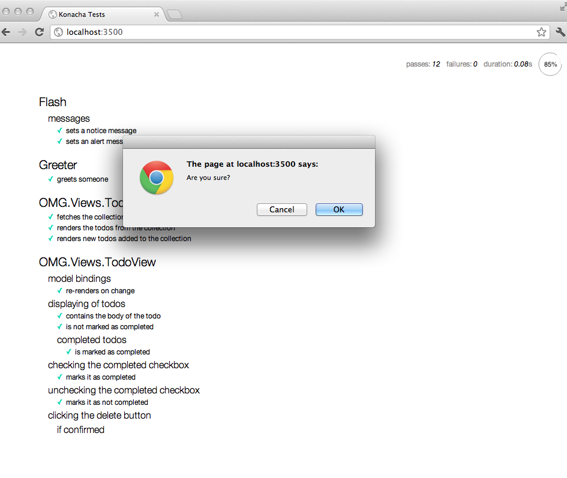
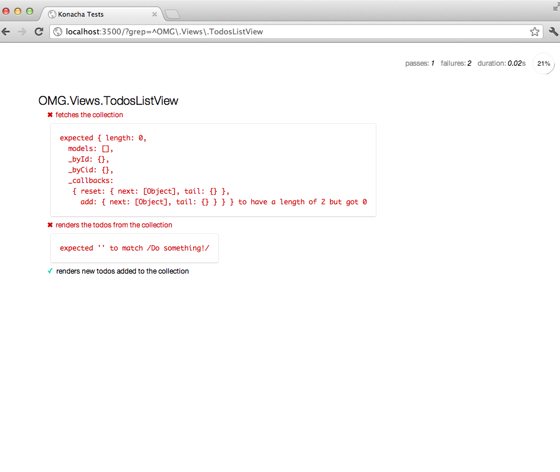

# Testing Your JavaScript/CoffeeScript, Part 2 of 2: Writing Tests

## Previously...

In Part 1 of this series, Setting up Ruby on Rails for JavaScript/CoffeeScript Testing, [PLEASE LINK TO ARTICLE], I showed you how to set up [Mocha](http://visionmedia.github.com/mocha/) and [Chai](http://chaijs.com/) in a Ruby on Rails application so you can test your JavaScript, or in my case CoffeeScript code.

For those of you who are reading this article who do not use Ruby on Rails, don't worry, this article will have very little Rails in it. In this article we are going to focus on using Mocha and Chai, as well as a few other libraries, to test our code. Since that's the case you should be able to follow along.

## Getting Started

In order to demonstrate testing some "real" code, including DOM interactions, AJAX requests, conditionals, etc... we are going to need some code. I have created a simple Todo List application and placed the source code, along with the all of the tests we will write on Github.com, [https://github.com/markbates/informit_articles](https://github.com/markbates/informit_articles). Please feel free and download the code and play with it.

The front end code for this application was written in CoffeeScript and using the [Backbone.js](http://documentcloud.github.com/backbone/) JavaScript framework. It is this Backbone code we will be testing.

Don't worry too much if you don't understand fully everything the Backbone code is doing, it's easy enough to pick up, and I'll guide you through the more trickery parts.

### spec_helper.coffee

In Part 1 of this series we set up the testing frameworks and even got a basic test passing. Now that we are going to be testing more interesting than a simple `Greeter` class.

The first thing we need to do, before we can get down to the business at hand, is to create a file called `spec_helper.coffee` in the `specs/javascripts` folder. That file should look something like this:

<pre>
# Require the appropriate asset-pipeline files:
#= require application
#= require_tree ./support

# Any other testing specific code here...
# Custom matchers, etc....

Konacha.mochaOptions.ignoreLeaks = true

beforeEach ->
  window.page = $("#konacha")  
</pre>

The `spec_helper` file will be required by all of the test files we create. This way they will have access to a common set functionality and code.

_**Rails Alert** - The following contains material strictly related to Rails:_

The Konacha gem gives us access to the Rails asset-pipeline, with that we can call require all of our application's JavaScript and CoffeeScript code simply by adding the line:

<pre>#= require application</pre>

Next we will automatically require any files in the `spec/javascripts/support` directory (you'll need to create this folder):

<pre>#= require_tree ./support</pre>

The `support` directory will hold any third party scripts, or scripts we write, that are helpful to our tests, but not helpful the main application.

_**End of Rails Alert** - That's it for the Rails stuff folks._

The first interesting bit of code you'll notice here is the following line:

<pre>Konacha.mochaOptions.ignoreLeaks = true</pre>

While that might look like an odd thing to do, I've set the `ignoreLeaks` option to `true` because it doesn't seem to like when I add properties to the `window` object, as I'm about to do in the next bit of code. This flag prevents a whole series of warnings and errors from being thrown up.

<pre>
beforeEach ->
  window.page = $("#konacha")  
</pre>

The Mocha library has `beforeEach` and `afterEach` hooks that will be executed at their respective times in the test life cycle. For example, the `beforeEach` function we've defined here will be run before every single test.

In this `beforeEach` function I'm defining the `window.page` property to equal that of the DOM element `$("#konacha")`. What is this DOM element? It's inserted into the DOM by the Konacha gem to give tests a "playground" DOM. Between each test this element will be wiped clean (think database transactions for the DOM). I like to set it the `window.page` property because I feel my tests are easier to read, and should the DOM element change names later, I can change it in one place and not have to worry about it.

## DOM Interactions

The problem with writing an article such as this is I want to show you everything. I want to teach you all that I know. Unfortunately when you're limited to less than 2000 words, that becomes a tricky task. What I can do in that amount of space is to give you a brief introduction to a topic and help to guide you down the path to understanding. So with that said let's look at some code.

Here is the Backbone view we will be testing first:

<pre>
# app/assets/javascripts/views/todos/todo_view.js.coffee
class OMG.Views.TodoView extends Backbone.View

  tagName: 'li'
  template: JST['todos/_todo']

  events: 
    'change [name=completed]': 'completedChecked'
    'click .delete': 'deleteClicked'

  initialize: ->
    @model.on "change", @render
    @render()

  render: =>
    $(@el).html(@template(todo: @model))
    if @model.get("completed") is true
      @$(".todo-body").addClass("completed")
      @$("[name=completed]").attr("checked", true)
    return @

  completedChecked: (e) =>
    @model.save(completed: $(e.target).attr("checked")?)

  deleteClicked: (e) =>
    e?.preventDefault()
    if confirm("Are you sure?")
      @model.destroy()
      $(@el).remove()
</pre>

The `OMG.Views.TodoView` class is responsible for rendering a single instance of a `Todo` model to the page. It creates an `li` for the todo. If the todo is marked as `completed` it will make sure the checkbox next to its `body` is checked and will give the `body` a CSS class of `completed`.

This view will also listen for a two events. The first event is the checking/unchecking of the `completed` checkbox. When that occurs the model's state will be saved back to the server and the view will re-render itself to make sure it is displaying the correct information.

The second event occurs when someone clicks the `delete` button for the todo. The view will prompt the user with a JavaScript `confirm` dialog to confirm they really want to destroy the todo. If they confirm then the todo is destroy and the `li` is removed from the page. If they don't confirm, then nothing happens.

It is now our job to test a few of these scenarios, but how?

## jQuery to the Rescue

The `OMG.Views.TodoView` is a great example of JavaScript interacting with the DOM, and one of the most common things you will be testing. As you've probably noticed this class is doing its DOM interactions using jQuery, so why shouldn't we?

One of the beautiful elements of testing a JavaScript, or CoffeeScript, application is you can write user interaction tests using the same libraries you are already using to write your user interactions. I know, it's all very meta, but in its own way it's very beautiful.

Create a file called `spec/javascripts/views/todos/todo_view_spec.coffee`. This file will be where we write tests for the `OMG.Views.TodoView` class. Let's set it up like such:

<pre>
# spec/javascripts/views/todos/todo_view_spec.coffee
#= require spec_helper

describe "OMG.Views.TodoView", ->
  
  beforeEach ->
    @model = new OMG.Models.Todo(id: 1, body: "Do something!", completed: false)
    @view = new OMG.Views.TodoView(model: @model)
    page.html(@view.el)
</pre>

First we need to require the `spec_helper.coffee` file we created earlier. Here I show how you would do that in Rails, your framework maybe different. The `spec_helper` file will pull in all of the JavaScript/CoffeeScript files that our application needs, as well as any helper libraries, functions, and variables we may have set, such as the `page` variable.

Next tell Mocha that we want to `describe "OMG.Views.TodoView"` and then pass it a function. In this function we will write all of our tests. It is perfectly acceptable to nest `describe` blocks to help create a sense of context, as you'll soon see.

Finally we need to make sure that all of our tests have some basic information to work with. For our purposes here that would be an instance of a todo, `@model`, an instance of the view we are testing, `@view`, and we need to place the HTML from that view on to the page, `page.html(@view.el)`. 

You would think we'd be ready to finally to write some tests, but not quite. In order to make our tests easier to read and write we should use the [chai-jquery](http://chaijs.com/plugins/chai-jquery) plugin. This plugin will give us access to some custom matchers that match the jQuery API functions you are already used to. Now we are ready to write our tests.

<pre>
# spec/javascripts/views/todos/todo_view_spec.coffee
  describe "displaying of todos", ->
    
    it "contains the body of the todo", ->
      $('.todo-body').should.have.text("Do something!")

    it "is not marked as completed", ->
      $('[name=completed]').should.not.be.checked
      $('.todo-body').should.not.have.class("completed")
</pre>

In these two tests we are asserting that the body of the todo is being rendered to the page where we expect it. We are also asserting that, since the todo we created was not marked as `completed`, that the checkbox remains unchecked and that the CSS style `completed` has not been applied.

Since todos can be marked as `completed` we should test for that scenario as well. We can simulate a user interacting with the checkbox to mark the todo as `completed` using jQuery.

<pre>
# spec/javascripts/views/todos/todo_view_spec.coffee  
    it "renders completed todos correctly", ->
      $('[name=completed]').click()
      $('[name=completed]').should.be.checked
      $('.todo-body').should.have.class("completed")
</pre>

In this test we are actually testing two different things. First we are testing that when a user clicks on the `completed` checkbox that the view listens to that event and redraws the HTML. We are also testing that the view draws the correct HTML for a `completed` todo.

## Should I or Shouldn't I?

Skipping ahead, let us look at what happens when a user clicks the `delete` button. We know that a confirm dialog box appears and if the user confirms then the `li` gets removed from the page, otherwise it does nothing.

<pre>
# spec/javascripts/views/todos/todo_view_spec.coffee  
  describe "clicking the delete button", ->

    describe "if confirmed", ->
      
      it "will remove the todo from the page", ->
        page.html().should.contain($(@view.el).html())
        $(".delete").click()
        page.html().should.not.contain($(@view.el).html())

    describe "if not confirmed", ->
      
      it "will not remove the todo from the page", ->
        page.html().should.contain($(@view.el).html())
        $(".delete").click()
        page.html().should.contain($(@view.el).html())
</pre>

If we were to run this test in the browser we would get something similar to figure 1.

As you can see the `confirm` pop up presents itself and we have to manually click `OK` or `Cancel`. This isn't going to work in a headless browser, and certainly we can't be expected to have to manually click the appropriate answer for each test. So how do we fix this?

We can solve this sort of problem using stubs. Stubs let us "fake" out parts of code and have those bits of code return what we want them to. In this case we want to stub out the browsers `confirm` prompt and have it return `true` or `false` based on what is most appropriate for the test at hand. Enter [Sinon.js](http://sinonjs.org/) to solve this, and other issues for us, as we'll see in just a minute.

Simply download `sinon.js` and place it into the `spec/javascripts/support` folder and the `spec_helper.coffee` file will automatically pick it up and make it available to us.

Now we can easily stub out the `confirm` function to return `true` or `false` depending on our needs, like such:

<pre>
# spec/javascripts/views/todos/todo_view_spec.coffee
  describe "clicking the delete button", ->

    describe "if confirmed", ->

      beforeEach ->
        @confirmStub = sinon.stub(window, "confirm")
        @confirmStub.returns(true)

      afterEach ->
        @confirmStub.restore()
      
      it "will remove the todo from the page", ->
        page.html().should.contain($(@view.el).html())
        $(".delete").click()
        page.html().should.not.contain($(@view.el).html())
</pre>

It's important to call the `restore` function on the stub after we are finished with it so that the original functionality of the stubbed function is returned, otherwise it could lead to some very potentially unusual issues with other tests further down the line.

With that stub in place the tests will run through without actually prompted you to confirm, but it will think it has.

## Where's the Remote?

The last detail of testing, pretty much any decent JavaScript application, is interacting with AJAX requests. Whether you are getting a list of objects, or creating a new object through an API call, your application will no doubt likely need to make AJAX requests at some point, and these need testing. The sample todo application we have been talking about here is no different.

When the todo list is first loaded we need to get a list of existing todos from the server and display them to the page. We have already looked at how we display those individual todos, but how do we get that list of todos from the server in our tests? Certainly we don't actually want to connect to a running server and interact with it over actual AJAX requests? Of course not, that would be both problematic and slow. Instead we are going to use Sinon, again, this time to stub out AJAX requests and responses.

<pre>
# app/assets/javascripts/views/todos/todo_view.js.coffee
class OMG.Views.TodosListView extends Backbone.View

  el: "#todos"

  initialize: ->
    @collection.on "reset", @render
    @collection.on "add", @renderTodo
    @collection.fetch()

  render: =>
    $(@el).html("")
    @collection.forEach (todo) =>
      @renderTodo(todo)

  renderTodo: (todo) =>
    view = new OMG.Views.TodoView(model: todo, collection: @collection)
    $(@el).prepend(view.el)
</pre>

The way the `OMG.Views.TodosListView` class works is quite simple. When it is initialized we will give it an empty collection (`Backbone.Collection`) and tell it to render all of its todos when it receives a `reset` event. The `reset` event is triggered when you call the `fetch` function on the collection. It is the `fetch` function that makes an AJAX call back to the server to get the list of todos. That's the part we need to make work.

First let's take a look at what the tests for this should look like:

<pre>
# spec/javascripts/views/todos/todo_list_view.coffee
#= require spec_helper

describe "OMG.Views.TodosListView", ->
  
  beforeEach ->
    page.html("&lt;ul id='todos'&gt;&lt;/ul&gt;")
    @collection = new OMG.Collections.Todos()
    @view = new OMG.Views.TodosListView(collection: @collection)
  
  it "fetches the collection", ->
    @collection.should.have.length(2)

  it "renders the todos from the collection", ->
    el = $(@view.el).html()
    el.should.match(/Do something!/)
    el.should.match(/Do something else!/)
</pre>

These tests are pretty straight forward. We are asserting that we get 2 todos back from the server and that they are printed out to the screen. Figure 2 shows what happens when we try to run these tests:

The answer should be immediately obvious, the `@collection` object is not receiving a response from the server when the `fetch` function is called because we don't have a server running to respond to it.

In the `spec/javascripts/support` folder create a new file called, `mock_responses.coffee`, that looks like this:

<pre>
# spec/javascripts/support/mock_responses.coffee
window.MockServer ?= sinon.fakeServer.create()

MockServer.respondWith( 
  "GET",
  "/todos",
  [
    200, 
    { "Content-Type": "application/json" },
    '''
    [
      {"body":"Do something!","completed":false,"id":1}, 
      {"body":"Do something else!","completed":false,"id":2}
    ]'''
  ]
)
</pre>

The Sinon library conveniently ships with a sub-library that let's you start up a "fake" server and respond to incoming requests. In reality it's not really starting a server, but rather stubbing out low level networking protocols in JavaScript.

In the `mock_responses.coffee` file we create a new instance of this "fake" server, if one does not already exist. We then tell it if it receives a `GET` request for the URL `/todos`, return with a response code of `200`, some headers, and `string` containing a JSON array that represents two todos.

If we were to run the specs again right now, they would still fail. The reason is because we have not told Sinon to actually respond to the request. We've told it what we would like the given response to be, but to actually give that response when it is asked. There are lot of technical reasons why it doesn't respond automatically, unfortunately they are out of the scope of this article.

So how, and when, and we tell Sinon to respond to the request. We do that after the AJAX call has been made in the test. We can update the `beforeEach` of this test to look like this:

<pre>
# spec/javascripts/views/todos/todo_list_view.coffee
  beforeEach ->
    page.html("<ul id='todos'></ul>")
    @collection = new OMG.Collections.Todos()
    @view = new OMG.Views.TodosListView(collection: @collection)
    MockServer.respond()
</pre>

Now notice how we have added the line `MockServer.respond()` to the end of the `beforeEach` block? That will tell Sinon to respond to the `fetch` call that was made in the `initializer` function in the in the `OMG.Views.TodosListView` class.

The tests should now successfully pass! Congratulations.

## Wrapping Up

Well folks, there you have it, a very, _very_, whirlwind tour of testing JavaScript and CoffeeScript code using Mocha and Chai (and a few friends along the way). I know there was a lot to cover, and I know we covered it fast, but I hope that you got a few things out of it.

I hope you saw that it was actually relatively painless to test a "complex" application. I chose to show you excerpts from a "real" application, instead of contrived examples, to help that point really sink in. I know for me it's always great to see code "in action", and nothing is more "in action", than a Backbone app.

Happy testing everyone!

PS. If you struggled with the CoffeeScript in this article, I know a great book that can help you learn it. Now, what was the name of it again? Oh yeah, [Programming in CoffeeScript](http://books.markbates.com) by me. Enjoy. 